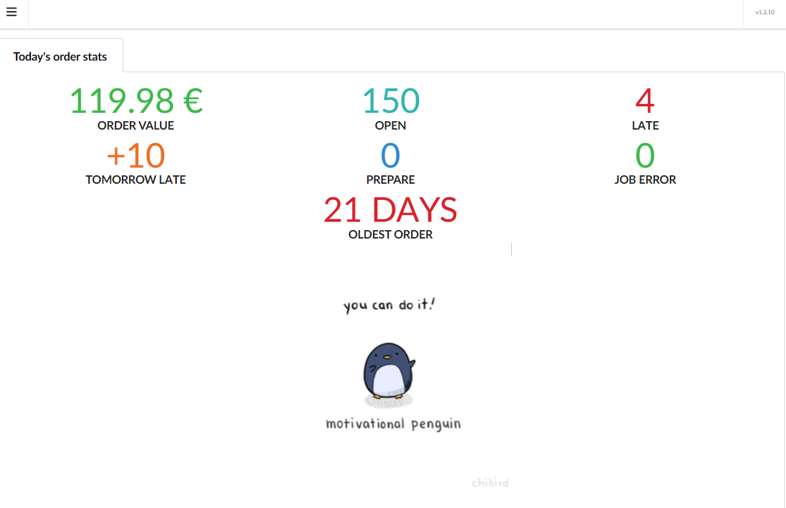
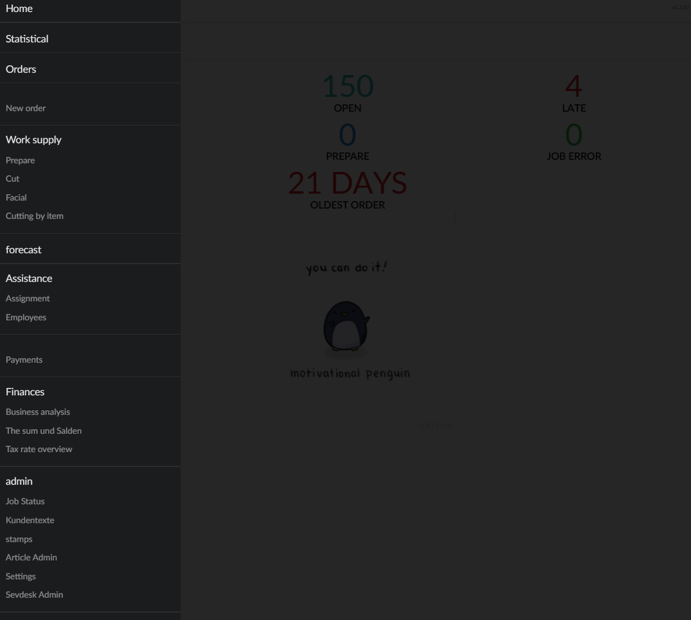
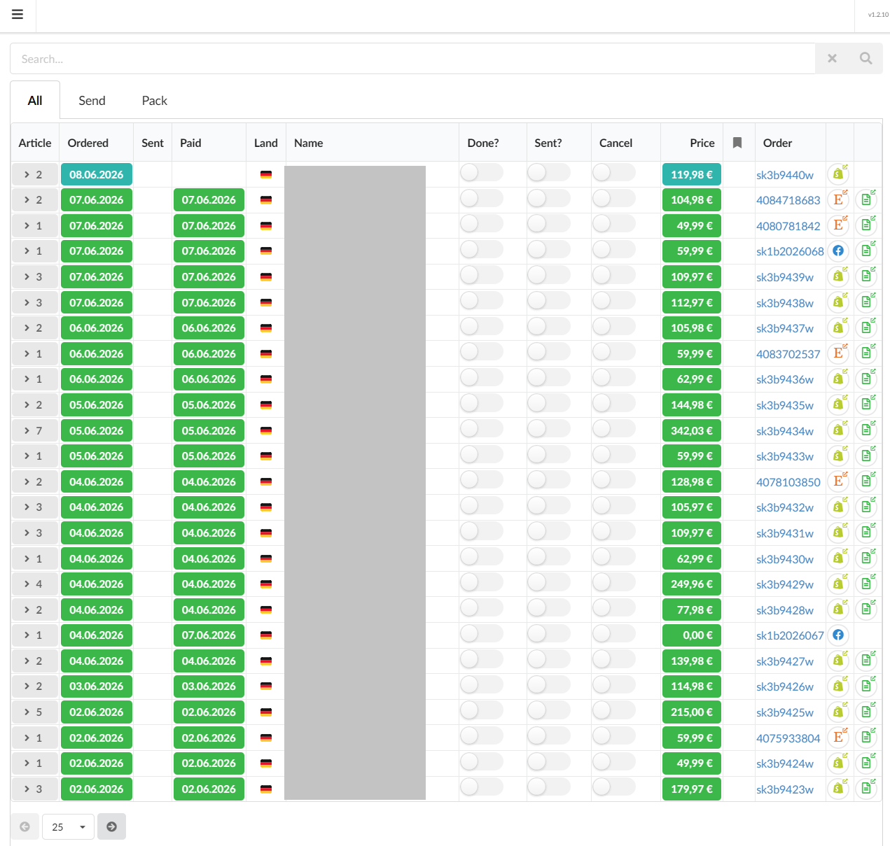
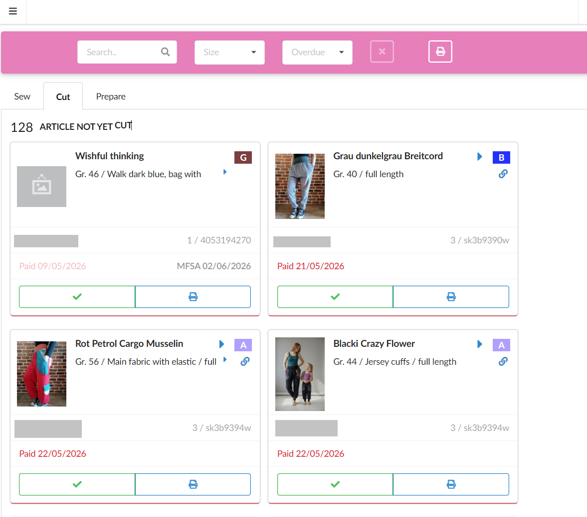

# Welcome
Welcome to my Github!

## Repos
All my repos are private. I'm happy to provide access to potential employers, recruiters, hiring managers or interviewers. I would be thrilled to discuss the codebase in depth with anyone that is interested. 

Here are some of the more substantial projects I've built:

### [schniesel-bestell](https://github.com/wulf0r/schniesel-bestell-rework)

**Multichannel order managment system** for our family business [Schniesel-Kids](https://www.schniesel-kids.de). It unifies order handling for orders from Shopify, Etsy, E-Mail and Facebook.

**~35k LOC**

### Features

* order forms for manual entry
* order lists with search
* order status managment (New -> Paid -> Prepared -> Finished -> Sent)
* product label printing
* syncs products and orders from Shopify and Etsy
* automatically creates invoices in Sevdesk based on the orders in the app
* supports production planning
* automates customer notification
* prints DHL Labels from orders
* Transaction retrieval from Bank and Paypal for semi-automatically determining orders "paid" status

#### History & Impact
The first version went live in 2015 (Java + Apache Tapestry) with the main goal of automatically determining paid status. Over the years it evolved into the **central operations system** of the company.

The existence of this tool (and Artikel-UI) enabled an fast and smooth migration from the old EPages shop to Shopify. Today it saves my wife dozens of hours per week, allowing her to focus on product design instead of bureaucracy.

In 2022 I fully rewrote the system in **Kotlin Multiplatform** — a complete shift to a modern, type-safe, Mobile-First SPA architecture.

#### Tech Stack
* Frontend: Kotlin/JS with Fomantic UI
* Backend: Kotlin Multiplatform with KTOR
* Persistence: H2 via JOOQ "SQL in Kotlin"
* Testing: Spock Framework and Selenium
* CI and deployment: Github actions build releases that are pulled into a docker image

#### Screenshots

Screenshots are auto-translated. The software itself is only in German. PII is hidden with a grey block or just dummy values.

##### Start page, showing today's order stats at a glance

Start page shows how many orders are open (150), how many are overdue (4) and how many will be overdue tomorrow. It also shows 
the age of the oldest order as well as any errors from the job system.

##### Application Menu

Side menu shows all the features: 
* Statistics: in depth stats screen
* Orders: order table
* New order: new order for
* Work supply: order backlog by line item split by production stage
* Prepare: all line items in the prepare stage
* Cut: all line items in the (fabric) cut stage
* Facial (mistranslation of "Nähen", should be Sewing): all line items in the sewing state
* Cutting by item: printable overview of line items to cut by product they belong to, to facilitate fabric ordering
* Forecast: shows when orders will become overdue
* Assistance: supports contracting out orders
* Payments: Sync from bank and paypal with payment assignment
* Finance: different financial reports
* Admin: various settings and monitoring of the app itself

##### Order list

Order list show the list of orders. Only the ones to pack can be selected via tabs. The table shows order, sent and paid date, country of origin, name, price, order number.
The page provides also deep links to Shopify, Etsy and Sevdesk invoices (if created).
On the left hand side, the article arrow can be used to extend the entry to show the line items in the order

##### Work Backlog

This line item based view shows cards for each item in the selected stage. Here it's all items where the fabric has to be cut. 
The card has all the details such as product name, size and special requests.
The colored letters G, B, A and the assignment of the item to a bucketed storage which cuts down the search time for each item
when moving to the next stage or when picking for packing up the order. On this view, the line item label can be printed and the 
item can be moved along to the next stage. The grid can be searched by name and filtered according to size and overdue-ness.

